# "Отчёт по лабораторной работе №1"
## Дисциплина: Основы информационной безопасности
### Горпинич Елена Михайловна

---

# Цель работы

Приобретение практических навыков установки операционной системы на виртуальную машину, настройки минимально необходимых для дальнейшей работы сервисов. 

---

# Задание

Установка операционной системы на виртуальную машину

---

# Выполнение лабораторной работы
1)  Для начала скачаем виртуальную машину. При использовании предлагаемой в
лабораторной работе виртуальной машины (VirtualBox) на моём компьютере
возникла не устраняемая ошибка. Поэтому я использовала виртуальную машину
UTM, скаченную с официального сайта https://mac.getutm.app. Запустим приложение (рис.[1])

---
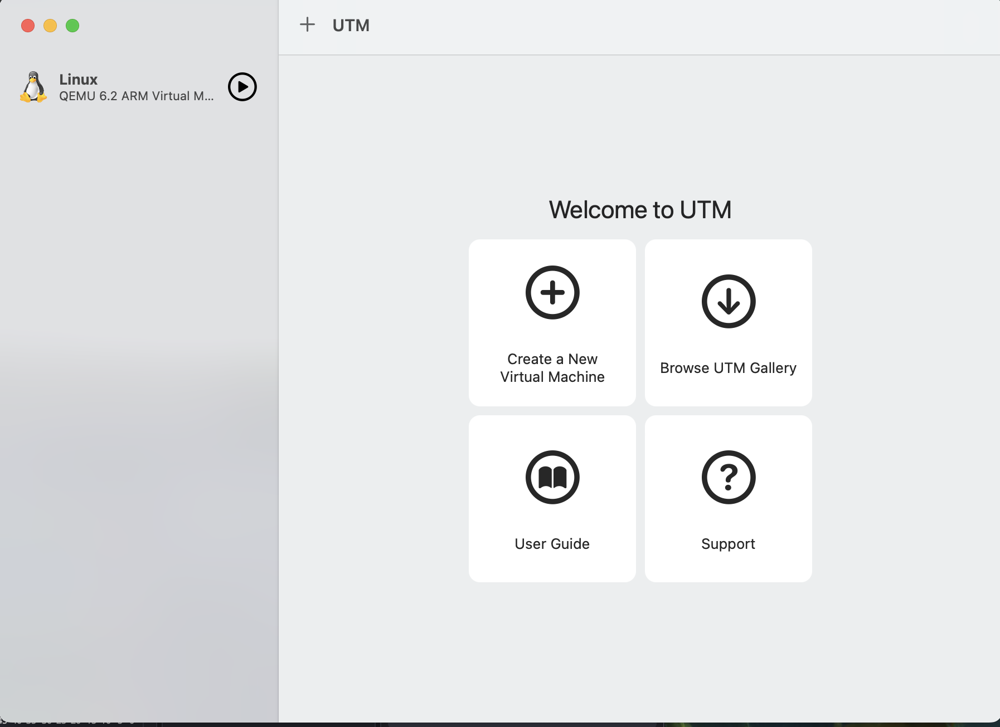

---
2)  Затем нажимаем "Create a New Virtual Machine" и далее выбираем "Virtualize" (рис.[2])

---
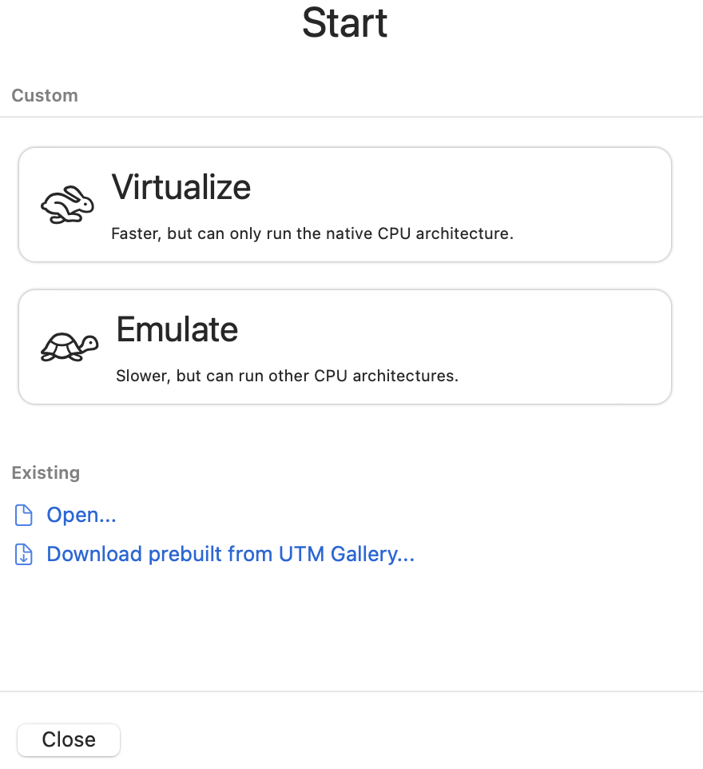

---
3)  Выбираем необходимую нам операционную систему. В нашем случае это будет Linux  (рис.[3])

---
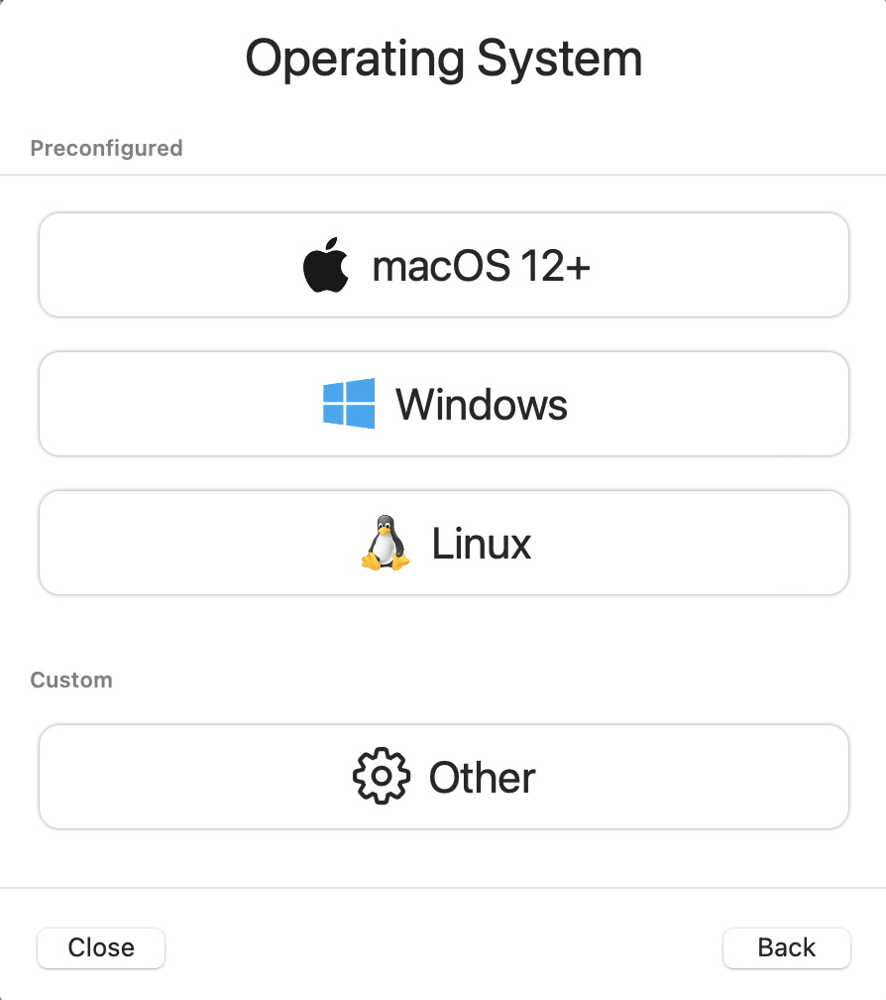

---
4) Также мной был загружен RockyLinux https://rockylinux.org/ru. Во время настройки укажем размер основной памяти виртуальной
машины — 4096 МБ и название «Linux». Добавим новый привод оптических
дисков выберем Rocky-9.4-aarch64-dvd.iso (рис.[4])

---

---

---
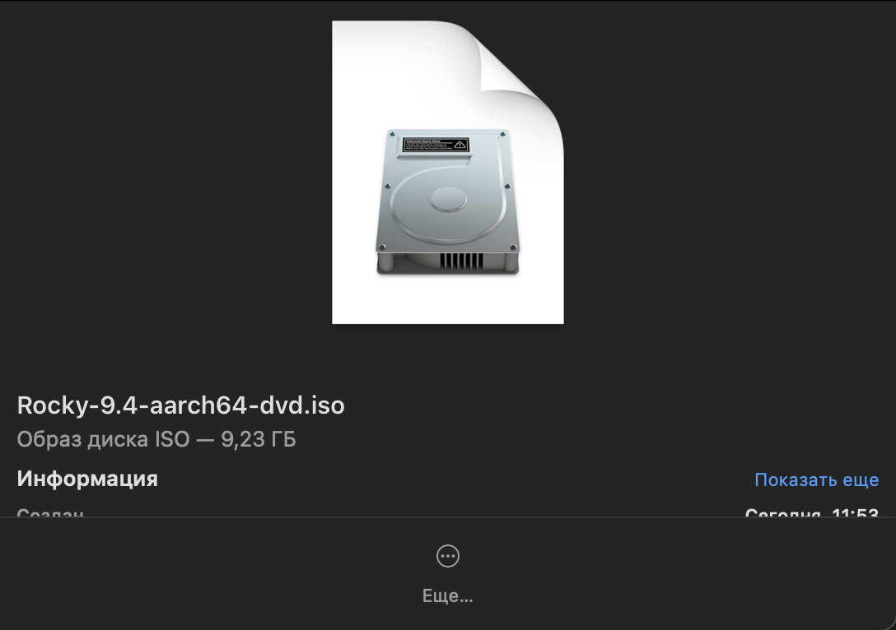

---
5)  Зададим место установки, пароль root и создадим пользователя (рис.[5-7])

---
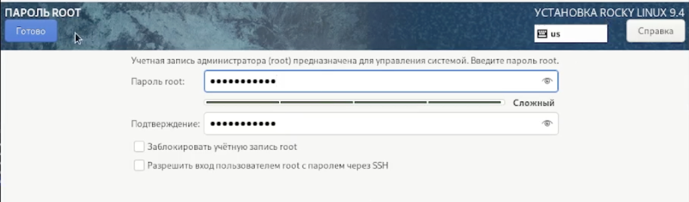

---
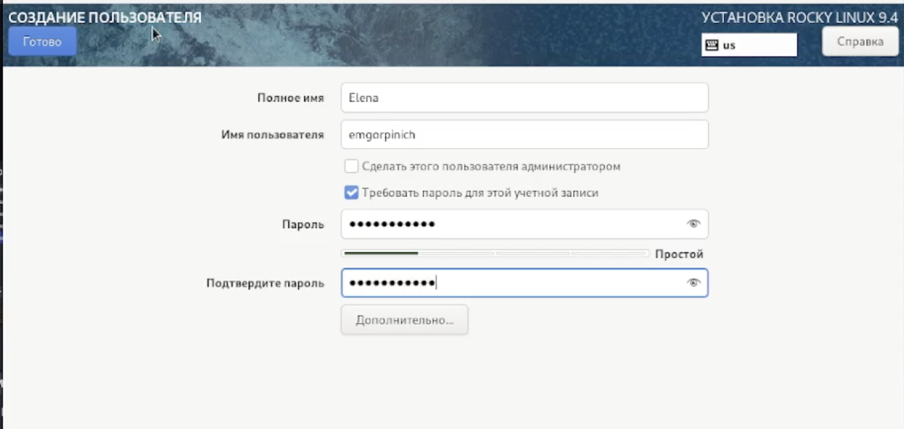

---
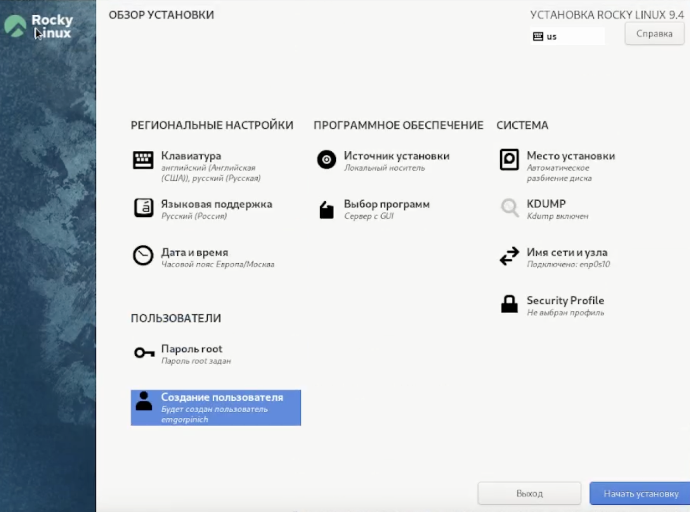

---
6)	Начинаем установку и ждем загрузку. Затем перезагружаем виртуальную машину и отключаем носитель информации. После нажимаем «restart» (рис.[8-9])

---
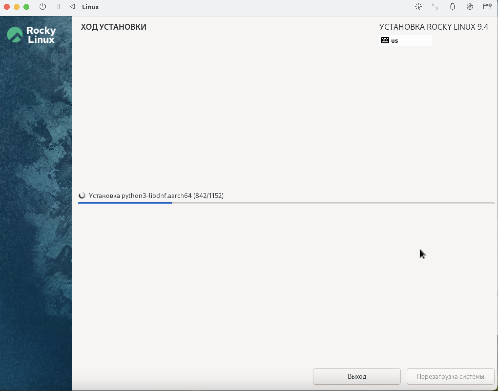 

---
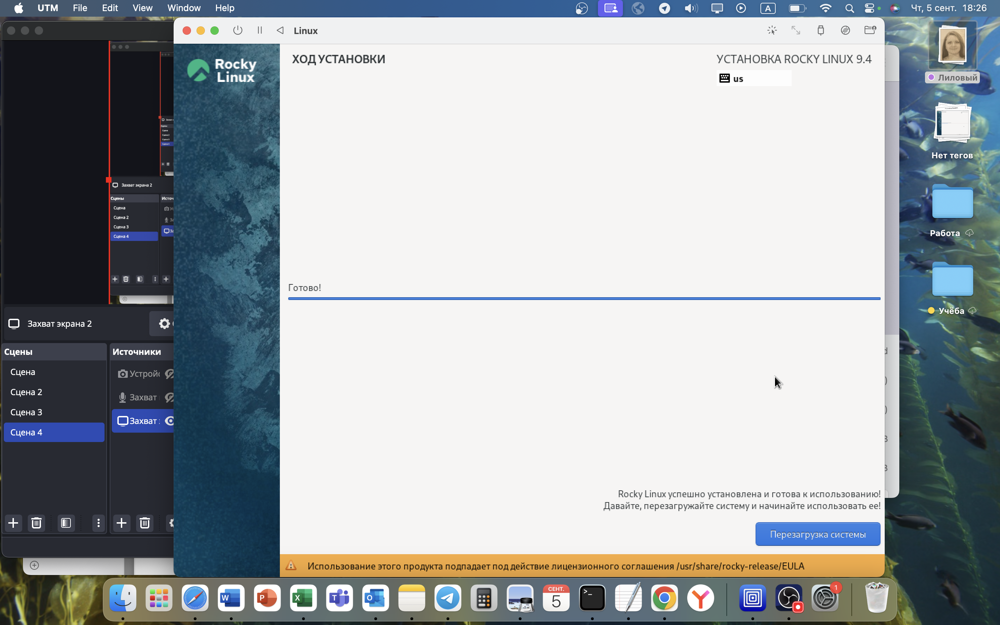

---
7)	После перезагрузки вводим пароль пользователя и на этом установка завершена (рис.[10-11])

---
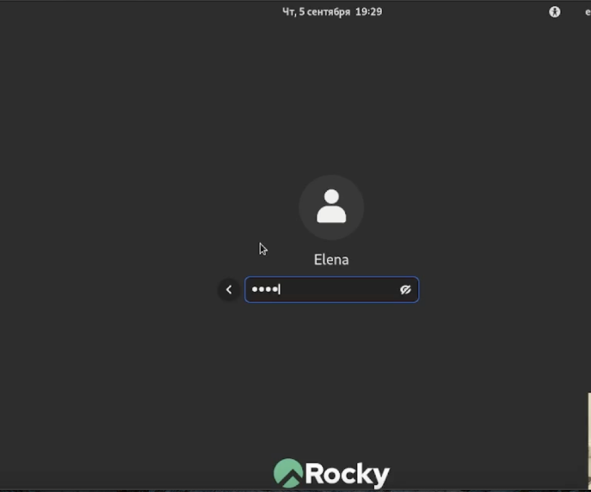

---
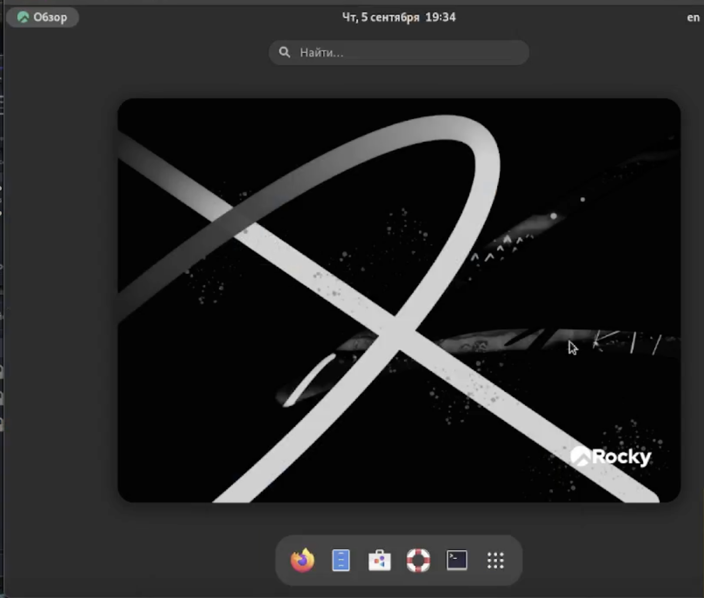

---
8) С помощью grep: dmesg | grep -i "то, что ищем"
Получили необходимую информацию. 
1. Версия ядра Linux (Linux version).
2. Частота процессора (Detected Mhz processor).
3. Модель процессора (CPU0).
4. Объем доступной оперативной памяти (Memory available). 
5. Тип обнаруженного гипервизора (Hypervisor detected).
6. Тип файловой системы корневого раздела.	(рис.[12-14])

---
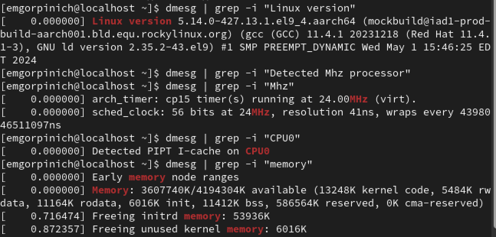

---
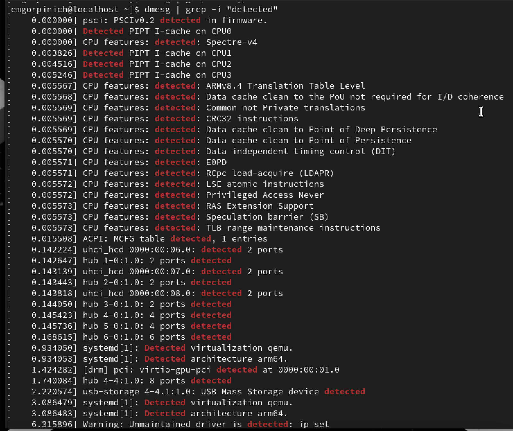

---
 

---
# Вывод

Приобрела практических навыков установки операционной системы на виртуальную машину.

---

# Контрольные вопросы
1) Учетная запись пользователя содержит информацию необходимую для
идентификации пользователя при подключении к системе. Т. е. имя
пользователя и пароль

---
2) Команды терминала и примеры к ним
o Для получения справки по команде: man
Чтобы получить справку по команде, введите man перед ней, например, man bash выдаст
руководство по терминалу.
- Для перемещения по файловой системе: cd
- Для просмотра содержимого каталога: ls
- Для определения объёма каталога: du
- Для создания каталогов/файлов: mkdir
-Удаление каталогов: rm, удаление файлов: rmdir
- Для задания определённых прав на файл/каталог: chmod
- Для просмотра истории команд: history

---
3) Файловая система — это часть операционной системы, назначение которой
состоит в том, чтобы обеспечить пользователю удобный интерфейс при работе с
данными, хранящимися на диске, и обеспечить совместное использование
файлов несколькими пользователями и процессами
- FAT- классическая архитектура файловой̆ системы, которая из-за своей̆
простоты всё ещё широко применяется для флеш-накопителей
-  NTFS - это система организации файлов обычно используемая на жестких
дисках компьютеров под управлением Microsoft Windows.
- Ext4 - это результат эволюции Ext3, наиболее популярной файловой системы в
Linux. Предполагает изменения в важных структурах данных, таких как,
например, предназначенных для хранения данных файлов.
4) С помощью команды findmnt можно посмотреть какие файловые системы
подмонтированы в ОС
5) Команда pidof, которая принимает в качестве параметра название процесса
и выводит его PID. Когда известен PID процесса, мы можем убить его командой
kill. Команда kill принимает в качестве параметра PID процесса. Команда
killall в Linux предназначена для «убийства» всех процессов, имеющих одно
и то же имя. Это удобно, так как нам не нужно знать PID процесса.

---